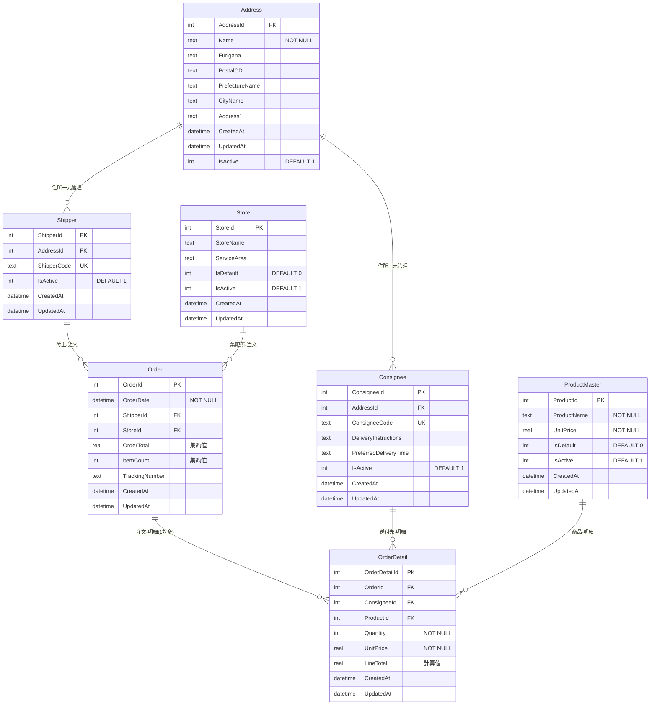

# HighLandirect Web版

React + CloudFlare D1 + MUIを使用したHighLandirectのWeb版アプリケーションです。

## 🚀 Live Demo

- **Frontend (CloudFlare Pages)**: https://highlandirect.pages.dev/
- **GitHub Pages**: https://koty.github.io/HighLandirectWeb/

## 概要

既存のWPF版HighLandirectアプリケーションをWeb化し、以下の機能を提供します：

- **注文管理**: 配送注文の作成・編集・一覧表示
- **荷主管理**: 配送依頼者の情報管理
- **送付先管理**: 配送先の情報管理
- **商品管理**: 配送商品の管理
- **集配所管理**: ヤマト運輸等の集配所情報管理

## データベース設計（ER図）



### 主要な設計特徴
- **住所一元管理**: AddressテーブルでShipper・Consigneeの住所情報を統合
- **Order正規化**: Order（ヘッダー）+ OrderDetail（明細）の1対多構造
- **集約値管理**: OrderTotal・ItemCountはOrderDetailから自動計算
- **2025/8/13**: Order model refactoringにより正規化構造に移行完了

詳細なER図とデータベース仕様は [`docs/README.md`](./docs/README.md) を参照してください。

## 技術スタック

### フロントエンド
- **React 18** - UIライブラリ
- **TypeScript** - 型安全な開発
- **Material-UI (MUI)** - UIコンポーネント
- **React Router** - ルーティング
- **React Query** - データフェッチング
- **React Hook Form** - フォーム管理
- **Vite** - ビルドツール

### バックエンド（予定）
- **CloudFlare Workers** - サーバーレス関数
- **CloudFlare D1** - SQLiteベースのデータベース
- **itty-router** - ルーティング

## セットアップ

### 前提条件
- Node.js 18+
- npm または yarn

### フロントエンド開発

```bash
# 依存関係をインストール
npm install

# 開発サーバー起動
npm run dev

# ビルド
npm run build

# 型チェック
npm run type-check

# リント
npm run lint
```

### バックエンド開発（将来）

```bash
# CloudFlare Workers開発環境
npm run dev:workers

# D1データベース作成（要認証）
cd backend
npx wrangler d1 create highlandirect-db
```

## デプロイ

### CloudFlare Pages
- 自動デプロイ: GitHubリポジトリ連携済み
- Build command: `npm run build`
- Build output directory: `dist`

### GitHub Pages
- GitHub Actionsで自動デプロイ
- `.github/workflows/deploy.yml`で設定済み

## 現在の状態

### ✅ 完全動作する機能
1. **ローカル開発環境**: `npm run dev` で即座起動可能
2. **フル機能ダッシュボード**: モックデータでの統計表示
3. **完全な注文管理**: 検索・フィルタ・作成フォーム
4. **マスタデータ管理**: 全エンティティの一覧表示
5. **レスポンシブUI**: デスクトップ・タブレット・モバイル対応
6. **型安全な開発**: TypeScript strict mode

### 🔜 次期実装予定
1. **CloudFlare D1連携**: 実際のデータベース接続
2. **CloudFlare Workers API**: REST APIエンドポイント
3. **日本郵便API連携**: 郵便番号自動補完
4. **ヤマトB2 API連携**: 印刷機能
5. **ユーザー認証**: 権限管理システム

## ディレクトリ構造

```
├── src/                    # フロントエンドソース
│   ├── components/         # Reactコンポーネント
│   ├── pages/             # ページコンポーネント
│   ├── types/             # TypeScript型定義
│   ├── api/               # API クライアント
│   ├── data/              # モックデータ
│   └── theme.ts           # MUIテーマ設定
├── backend/               # バックエンド設定（CloudFlare Workers）
│   ├── wrangler.toml      # Workers設定
│   └── .dev.vars.example  # 環境変数テンプレート
├── public/                # 静的ファイル
├── dist/                  # ビルド出力
└── .github/workflows/     # GitHub Actions
```

## ライセンス

Private Project

## 開発チーム

- Frontend: React + MUI + TypeScript
- Backend: CloudFlare Workers + D1（実装予定）
- Deployment: CloudFlare Pages + GitHub Pages